# aws-ship-it — my Bill Guard backend, rebuilt as code and shipped by a tested pipeline

**Every change is tested automatically. Nothing reaches AWS unless the tests pass. No AWS keys are stored anywhere.**

Built by Sanduni · London · 24 September 2026 · AWS Certified Cloud Practitioner

   

---

## In one minute

In [Project 2](https://github.com/sanduaws17767-oss/aws-bill-guard) I built **Bill Guard**, a live tool that tells people roughly what their AWS setup will cost. I built it by clicking in the AWS console.

Clicking works once. But it is hard to repeat, hard to check, and easy to get wrong.

So in this project I rebuilt the same backend **as code**, and added a **pipeline** that:

1. checks my code and runs 11 tests on every change,
2. blocks the change if anything fails,
3. deploys to AWS only after the change is merged, and
4. calls the live API afterwards to prove it really works.

The live Bill Guard is untouched. This project deploys a separate copy called **billguard-staging**.

**How I built it:** Claude guided me step by step. I did every step, ran every command, and debugged every failure myself.

---

## Contents

1. [The business story](#1-the-business-story)
2. [Architecture](#2-architecture)
3. [Services and why](#3-services-and-why)
4. [Three architectures, one builder](#4-three-architectures-one-builder)
5. [Trade-offs I considered](#5-trade-offs-i-considered)
6. [Proof it works](#6-proof-it-works)
7. [What broke and how I fixed it](#7-what-broke-and-how-i-fixed-it)
8. [What it costs](#8-what-it-costs)
9. [What I'd improve next](#9-what-id-improve-next)
10. [What's in the repo](#10-whats-in-the-repo)

---

## 1. The business story

Imagine a customer uses Bill Guard to plan a small website. They ask: "What will one small server cost me for a month?"

The right answer is about **$8.61**.

Now imagine a developer makes a one-character typo in the pricing code. The tool now says **$730**. The customer panics, or worse, trusts it and makes a bad decision.

In a clicked-together setup, nothing stops that typo from going live.

In this project, I made that exact typo **on purpose** to test my own safety net. The pipeline caught it in **12 seconds**, 3 tests failed, and the merge button was locked. No customer ever saw the wrong number. ([Proof below.](#proof-1--the-pipeline-blocks-a-bad-change))

That is the whole point of this project: **the customer should never be the one who finds the bug.**

**Why I built it:** the Amazon DevOps Engineer Apprentice role asks for CI/CD (Continuous Integration / Continuous Deployment), infrastructure as code, version control, automation scripts and monitoring. Before this project I had none of those. Now I have all five, with evidence.

---

## 2. Architecture

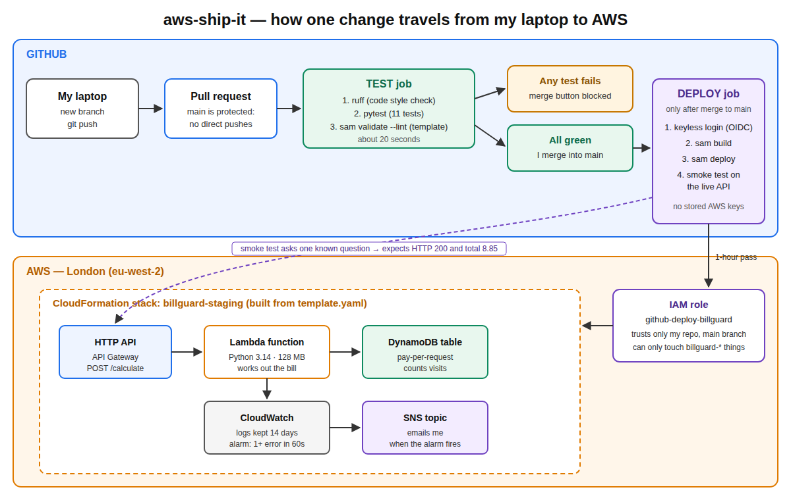

The same flow as a simple chart (GitHub draws this for you):

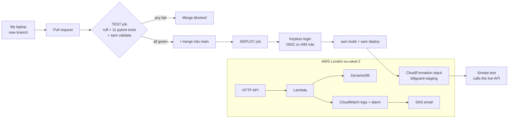
```mermaid
flowchart LR
    A[My laptop<br/>new branch] --> B[Pull request]
    B --> C{TEST job<br/>ruff + 11 pytest tests<br/>+ sam validate}
    C -- any fail --> D[Merge blocked]
    C -- all green --> E[I merge into main]
    E --> F[DEPLOY job]
    F --> G[Keyless login<br/>OIDC to IAM role]
    G --> H[sam build + sam deploy]
    H --> I[CloudFormation stack<br/>billguard-staging]
    I --> J[Smoke test<br/>calls the live API]

    subgraph AWS [AWS London eu-west-2]
      I
      K[HTTP API] --> L[Lambda] --> M[DynamoDB]
      L --> N[CloudWatch logs + alarm] --> O[SNS email]
    end
```

**In plain words:**

- **On a pull request**, only the TEST job runs. "Deploy to staging" shows as **skipped**. That is the gate working.
- **On a merge to main**, the TEST job runs again. Only if it passes does the DEPLOY job start.
- The DEPLOY job logs in to AWS **without any stored password or key**, builds the app, deploys it, and then runs a smoke test on the live API.

---

## 3. Services and why

### The AWS side (everything is created by `template.yaml`)

| Service | What it does here | Why I chose it |
|---|---|---|
| **AWS SAM** (Serverless Application Model) | Turns my short `template.yaml` into a full CloudFormation template. | It is AWS's own shorthand for serverless apps. About 90 lines describe the whole backend. |
| **CloudFormation** | Builds and updates everything as one "stack" called `billguard-staging`. | It keeps a record of every change. Updates only touch what changed (see [Proof 3](#proof-3--a-change-made-only-in-code)). |
| **API Gateway** (HTTP API) | Gives my code a web address: `POST /calculate`. | Cheaper and simpler than the older REST API type. |
| **Lambda** | Runs my Python pricing code. Python 3.14, 128 MB, 10-second timeout. | No servers to look after. It only runs, and only costs, when someone uses it. |
| **DynamoDB** | Counts how many times the tool is used. | Pay-per-request, so an idle table costs close to nothing. |
| **CloudWatch** | Keeps logs for 14 days. An alarm fires if Lambda has 1 or more errors in 60 seconds. | 14 days is enough to investigate a problem, without paying to keep logs forever. |
| **SNS** (Simple Notification Service) | Emails me when the alarm fires. | I find out about errors before anyone tells me. |
| **IAM** (Identity and Access Management) | A role called `github-deploy-billguard` that the pipeline borrows for 1 hour. | It can only touch things named `billguard-*`, plus SAM's own helper stack and bucket. Least privilege. |

### The GitHub side

| Tool | What it does here | Why I chose it |
|---|---|---|
| **GitHub Actions** | Runs the pipeline in `.github/workflows/pipeline.yml`. | Free for public repos, and it lives next to the code. |
| **Branch protection** | `main` needs a pull request **and** a green check. "Do not allow bypassing" is ticked. | The rule applies to me too, as the owner. No shortcuts. |
| **ruff** | A linter. It checks code style and common mistakes. | Very fast, and one tool covers a lot. |
| **pytest** | Runs my 11 tests on the pricing rules. | The same tests I wrote in Project 2, now running on every change. |
| **OIDC** (OpenID Connect) | Lets GitHub prove "this really is Sanduni's repo, on main" to AWS, and get a short-lived pass. | **No access keys are stored anywhere.** Nothing long-lived can leak. |
| **Bash smoke test** | `scripts/smoke_test.sh` asks the live API one known question and checks the answer. | A green deploy is not enough. I want proof the live API really answers. |

### The one code change

Only one line of the Project 2 code changed. The table name now comes from an environment variable:

```python
stats_table = dynamodb.Table(os.environ["TABLE_NAME"])
```

Before, the name was typed into the code. Now the same code can point at a staging table or a production table without editing it.

### Keyless login: who is allowed in

The IAM role only trusts **my repo, on the main branch**. GitHub changed its format for repos created from 15 July 2026, so I allowed **both** formats:

```json
"StringLike": {
  "token.actions.githubusercontent.com:sub": [
    "repo:sanduaws17767-oss/aws-ship-it:ref:refs/heads/main",
    "repo:sanduaws17767-oss@<OWNER-ID>/aws-ship-it@<REPO-ID>:ref:refs/heads/main"
  ]
}
```

The role's address is stored as a GitHub **variable** (it is not a secret). My alert email is stored as a GitHub **secret**, so it shows as `***` in the logs. The AWS account ID is written here as `<ACCOUNT-ID>`.

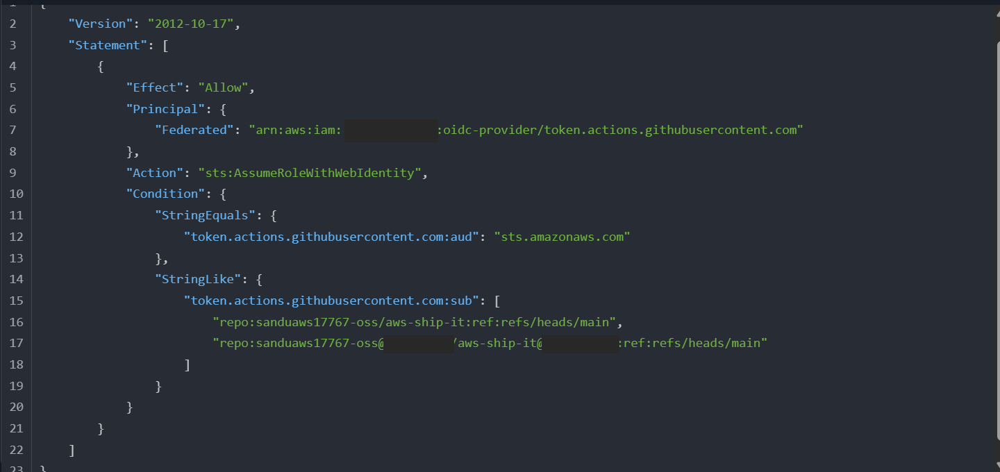
*Screenshot 12: the trust policy. Only my repo, only main, both formats. Account ID and number IDs hidden.*

---

## 4. Three architectures, one builder

This is my third AWS project. Each one builds on the last.

| | **Project 1**<br/>[aws-resilient-shop](https://github.com/sanduaws17767-oss/aws-resilient-shop) | **Project 2**<br/>[aws-bill-guard](https://github.com/sanduaws17767-oss/aws-bill-guard) | **Project 3**<br/>aws-ship-it (this repo) |
|---|---|---|---|
| **What it is** | A 3-tier web app: load balancer, EC2 servers with Auto Scaling, RDS database | A live serverless cost tool: Lambda, API Gateway, DynamoDB | The **same** Bill Guard backend as Project 2 |
| **How it was built** | Clicked in the console | Clicked in the console | Written as code (`template.yaml`) |
| **How it gets to AWS** | By hand | By hand | Automatically, by a pipeline, after tests pass |
| **How I proved it** | Chaos test: I killed a server on purpose. The site stayed up. | 11 tests on my laptop + real users | 11 tests on **every change**, a blocked bad change, and a smoke test on the live API |
| **Idle cost** | Costs money every hour | Close to nothing | Close to nothing |

**The story in one line:** servers by hand → serverless by hand → serverless as code, with an automated, tested pipeline.

---

## 5. Trade-offs I considered

- **AWS SAM vs Terraform.** Terraform is popular and works with many clouds. SAM only works with AWS, but it is made for serverless apps, the template is short, and AWS keeps track of what is deployed for me. For one small AWS app, SAM was the simpler choice. Terraform is a good next thing to learn.
- **Keyless login (OIDC) vs storing AWS access keys in GitHub.** Access keys are easier to set up, but they last until someone deletes them. If they leak, anyone can use them. OIDC gives the pipeline a pass that ends after 1 hour, and only my repo on main can get one. It took longer to set up (see [what broke](#the-big-one--the-first-deploy-failed-12-times)), but it is the safer answer.
- **"Do not allow bypassing" vs keeping an owner shortcut.** A shortcut would have been handy when I was debugging. But a rule with a back door is not really a rule. Every change, including mine, goes through a pull request and a green check.
- **Staging only vs staging + production.** A real team would add a production stage with a person approving each release. I cut this on purpose to finish a smaller project well. The template already has a `Stage` setting, so adding production later is mostly pipeline work.
- **One smoke test vs a full test suite against the live API.** The 11 unit tests check the pricing rules. The smoke test only checks that the **live** API answers one known question correctly (HTTP 200 and a total of 8.85). One quick, certain check after every deploy is enough for a project this size.
- **Change settings in code vs in the console.** Changing a setting by hand in the console causes **drift**: AWS and the template disagree, and the next deploy quietly overwrites the hand change. So I changed nothing by hand. [Proof 3](#proof-3--a-change-made-only-in-code) shows a setting changed only through code.
- **Pay-per-request table and 14-day logs vs fixed capacity and keeping logs forever.** Staging is used rarely. Paying only for use, and deleting old logs, keeps the idle cost close to nothing.
- **A small LITE scope vs my first 10-session plan.** I first planned Docker, a production gate, an incident drill, a runbook and a handler rewrite. On 24 September I cut it to 5 sessions, so I could finish it, understand every part, and explain it. The cut items are in [What I'd improve next](#9-what-id-improve-next).

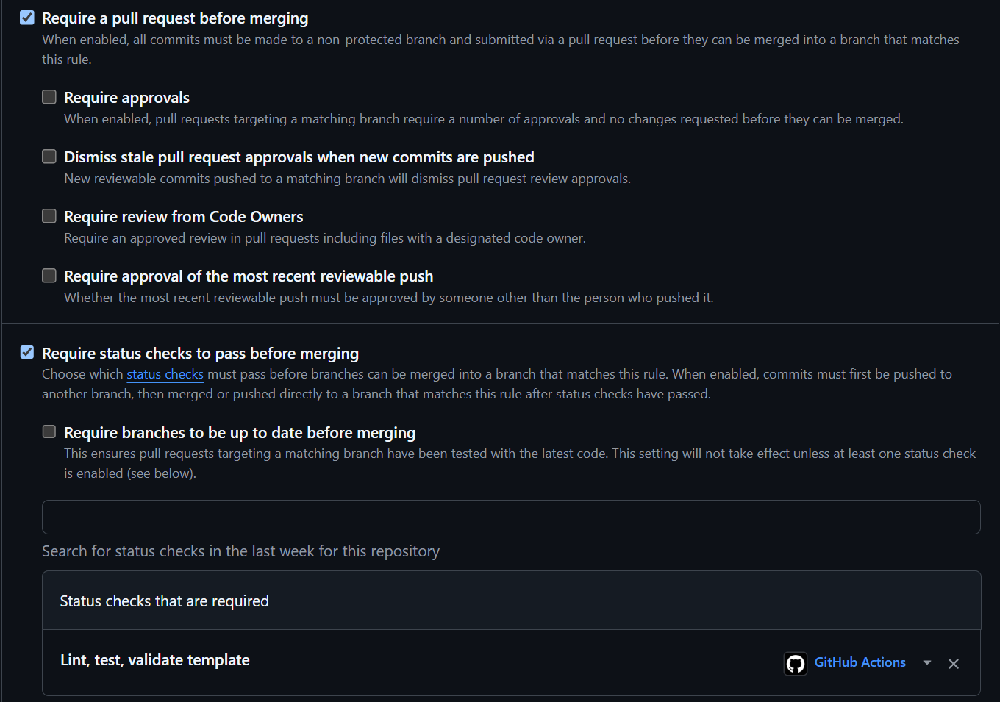
*Screenshot 2: `main` needs a pull request, and the check "Lint, test, validate template" must pass.*

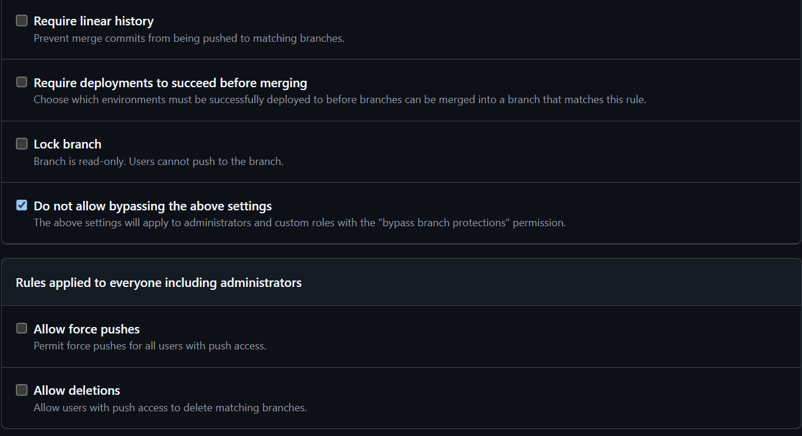
*Screenshot 3: "Do not allow bypassing" is ticked, so the rule applies to me too.*

---

## 6. Proof it works

### Proof 1 — the pipeline blocks a bad change

I opened pull request #3 and changed **one character** in the pricing rule for servers (`*` became `+`).

- The pipeline went red in **12 seconds**.
- **3 tests failed, 8 passed.**
- `test_full_month` expected **8.614**, and got **730.0118**.
- In plain words: a small server for a month (about $8.61) would have been shown to users as **$730**.
- The merge button was locked. I closed the pull request. Nothing reached `main` or AWS.

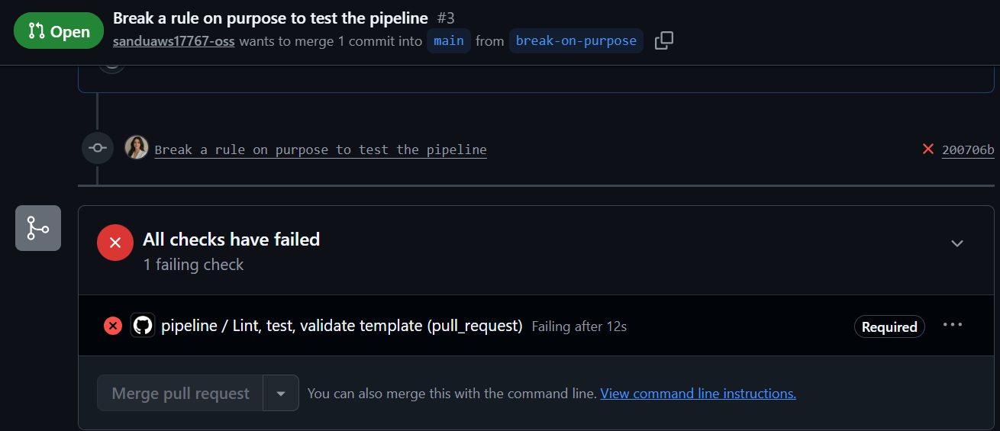
*Screenshot 4: the check failed after 12 seconds. The "Merge pull request" button is greyed out.*

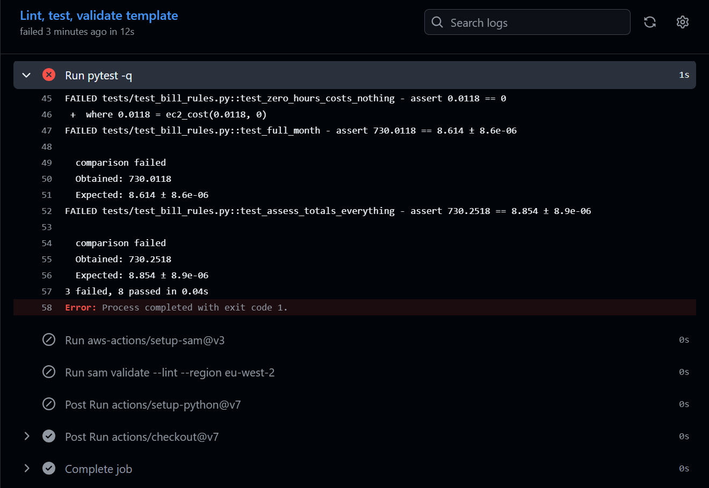
*Screenshot 5: why it failed. Expected 8.614, got 730.0118.*

### Proof 2 — the first real deploy, checked by a smoke test

Before this, the first pipeline run on pull request #2 was green in 19 seconds.

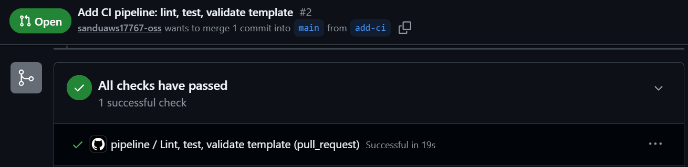
*Screenshot 1: lint, 11 tests and template check, all green in 19 seconds.*

After I fixed the login problem ([see below](#the-big-one--the-first-deploy-failed-12-times)), the deploy went green. The first deploy created the whole stack, so it took the longest: the deploy job ran for **2 minutes 20 seconds**.

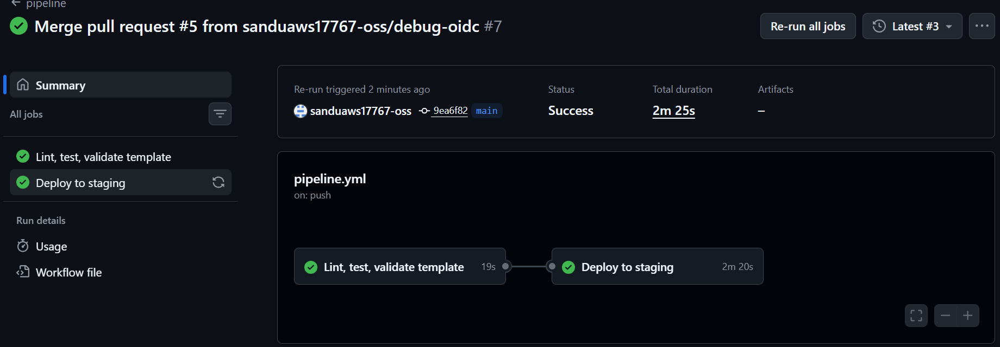
*Screenshot 13: the test job, then "Deploy to staging", both green.*

The smoke test then called the live API:

- HTTP status: **200**
- Total: **8.854** (Server 8.614 + Storage 0.24 + Database 0 + NAT gateway 0 + Data transfer 0)
- Warnings: none
- Result: **PASS**

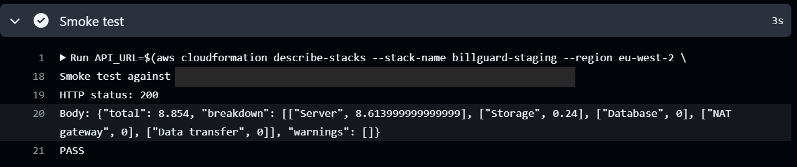
*Screenshot 14: the smoke test on the live API. The live address is hidden.*

CloudFormation built everything from the template: stack `billguard-staging` reached **CREATE_COMPLETE** with **31 events**, plus SAM's helper stack `aws-sam-cli-managed-default`. I did not click to create a single resource.

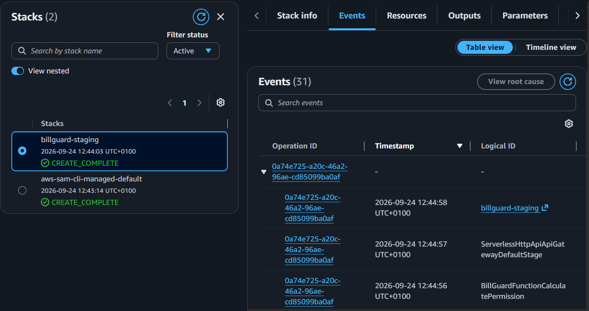
*Screenshot 15: both stacks CREATE_COMPLETE, 31 events.*

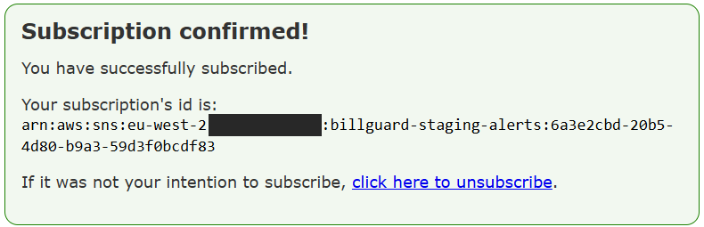
*Screenshot 16: the alarm's email topic, built by the template, with the subscription confirmed. Account ID hidden.*

After I removed the temporary debug step, the clean pipeline (run #10) went green end to end in **47 seconds**.

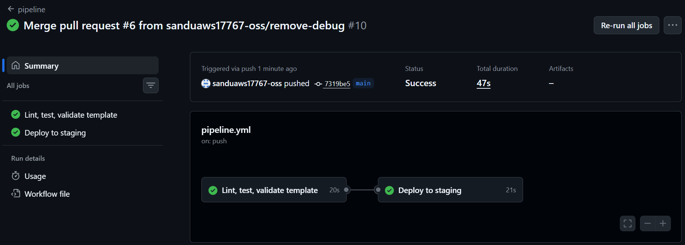
*Screenshot 17: run #10, green in 47 seconds.*

### Proof 3 — a change made only in code

To prove the template really controls AWS, I changed one setting: Lambda memory from **128 MB to 256 MB**. I changed it only in `template.yaml`. I never touched the Lambda console.

1. New branch `memory-256`, a one-line change, pull request #7.
2. The test check went green in **21 seconds**. "Deploy to staging" was **skipped**, because it was only a pull request.
3. I merged. Run #12 deployed it, green in **1 minute 13 seconds**.
4. CloudFormation events went from **31 to 36**. **Only `BillGuardFunction` changed.**
   - 13:13:56 `BillGuardFunction` UPDATE_IN_PROGRESS
   - 13:14:03 `BillGuardFunction` UPDATE_COMPLETE
   - 13:14:04 stack UPDATE_COMPLETE_CLEANUP_IN_PROGRESS
   - 13:14:05 stack UPDATE_COMPLETE
   - The table, the API and the alarm were not touched.
5. The Lambda console (I only looked, I changed nothing) showed **256 MB**.
6. Then I changed it back the same way: branch `memory-128`, pull request #8, merged. Run #14 was green in **1 minute 10 seconds**. Memory was back to **128 MB**.

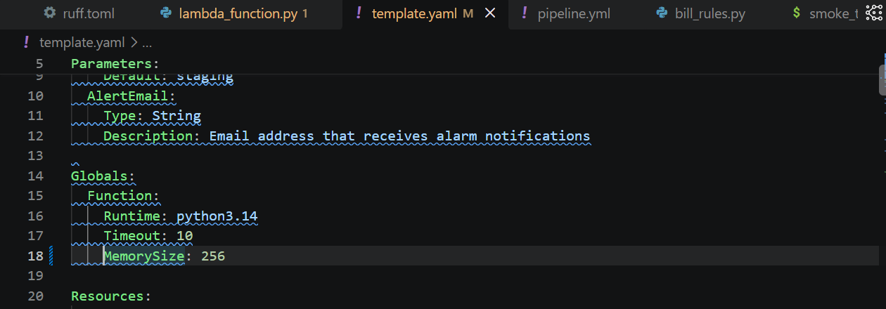
*Screenshot 19: the only change. `MemorySize: 256` in `template.yaml`.*

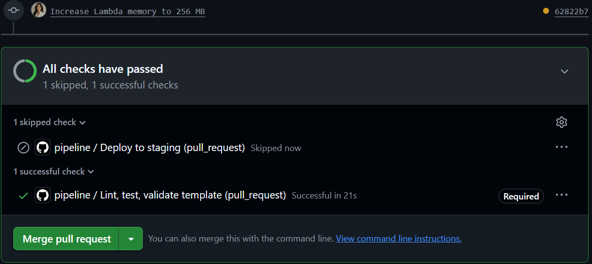
*Screenshot 18: on the pull request, the test passed and the deploy was skipped. That is the gate working.*

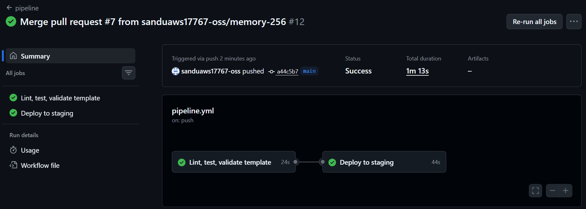
*Screenshot 20: after the merge, run #12 tested and deployed. Green in 1 minute 13 seconds.*

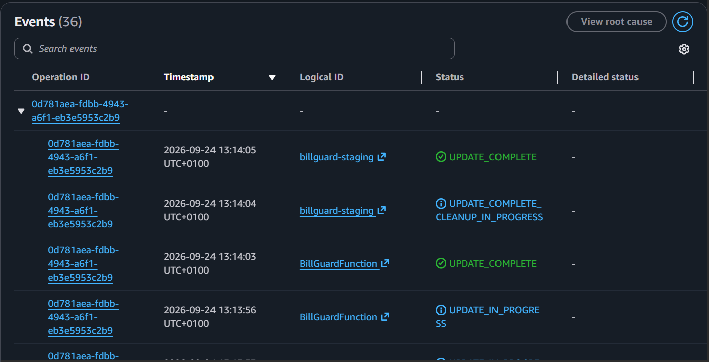
*Screenshot 21: the audit trail. 36 events. Only BillGuardFunction was updated.*

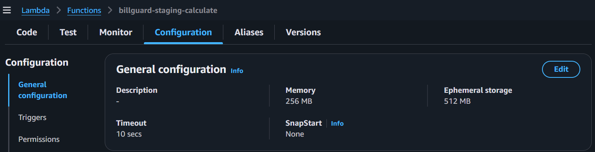
*Screenshot 22: Lambda now shows 256 MB. I looked. I did not click Edit.*

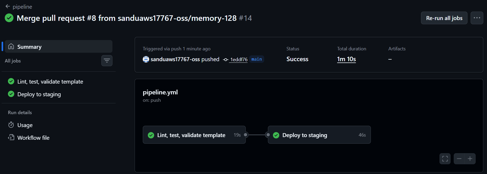
*Screenshot 23: changed back by code. Run #14, green in 1 minute 10 seconds.*

### Proof 4 — an honest history

The Actions page shows **14 workflow runs**. Every change is a pull request run, then a merge run. One red run (#8) is still there. I did not hide it. It is explained in [what broke](#7-what-broke-and-how-i-fixed-it).

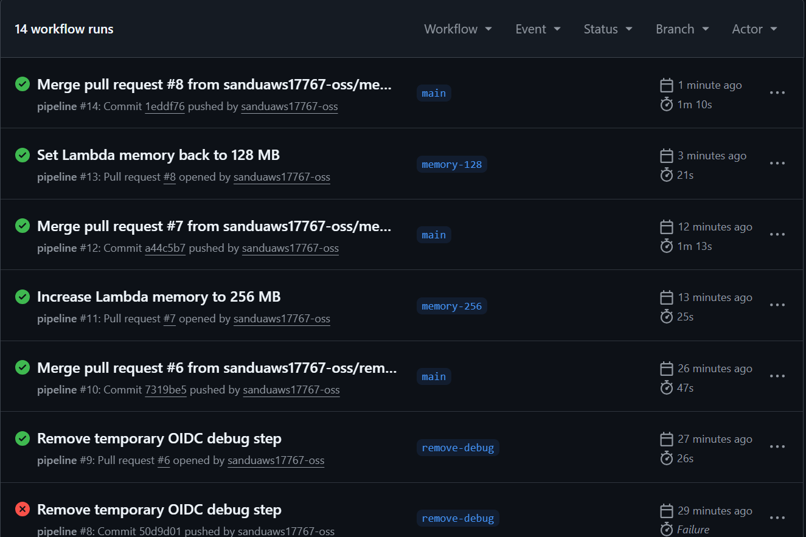
*Screenshot 24: the most recent runs out of 14. The red run #8 is at the bottom.*

---

## 7. What broke and how I fixed it

### The big one — the first deploy failed 12 times

The first deploy failed at the login step. It retried **12 times over 56 seconds**, then gave up:

> Could not assume role with OIDC: The web identity token provided could not be validated.

I re-ran it. It failed the same way. So it was not a one-off hiccup.

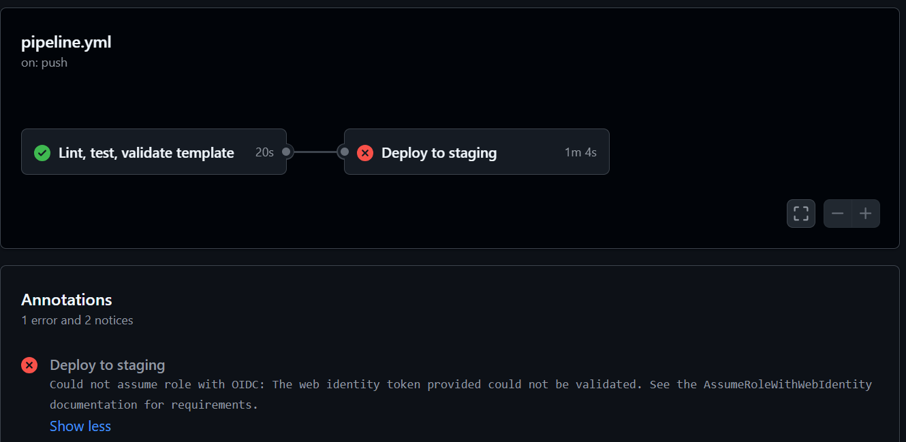
*Screenshot 8: the first deploy failed at the AWS login step.*

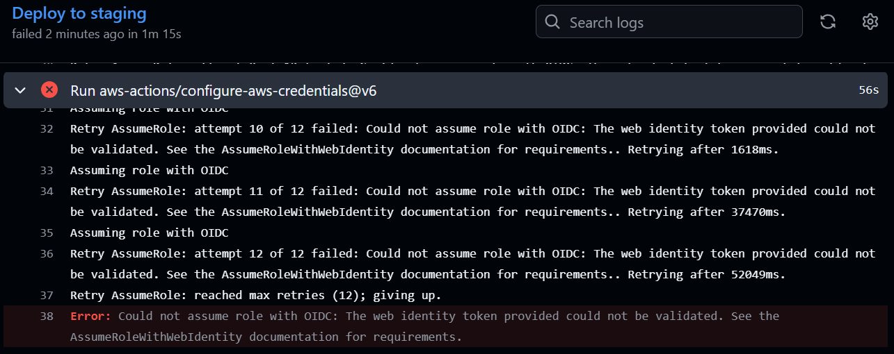
*Screenshot 9: attempt 12 of 12 failed. Max retries reached.*

I worked through it **one possible cause at a time**:

1. **The audience value.** I checked the identity provider. The audience was `sts.amazonaws.com`. Correct. Ruled out.
2. **The trust policy.** I checked it character by character against GitHub's documented format. Correct. Ruled out.
3. **CloudTrail** (AWS's record of who did what). I searched for `AssumeRoleWithWebIdentity` in London. **Nothing.** That told me AWS rejected the token itself, **before** it even looked at my role's rules.
4. **A temporary debug step.** I added a step to the pipeline that decoded the token and printed only its claims: who issued it (`iss`), who it is for (`aud`), and who it is about (`sub`). Never the token itself. All three matched my trust policy **exactly**. I then called AWS by hand, and it still said `InvalidIdentityToken`. So my rules were right. The fault had to be the identity provider's signature check.
5. **The fix.** I deleted and recreated the OIDC identity provider, with the same URL and audience. The role pointed to it automatically. I re-ran the pipeline: **deploy green, smoke test PASS.**

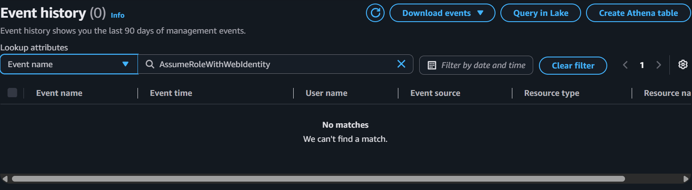
*Screenshot 10: CloudTrail had zero AssumeRoleWithWebIdentity events. AWS rejected the token before checking my role.*

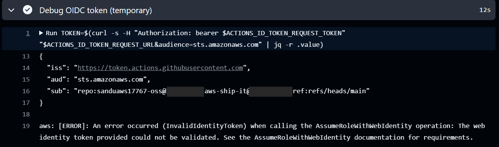
*Screenshot 11: the token's iss, aud and sub match my trust policy, and AWS still says InvalidIdentityToken. Number IDs hidden.*

**What I learned:** don't guess. Rule out one thing at a time, and use evidence (CloudTrail, the real token claims) to narrow it down.

### Removing the debug step — I deleted one line too many

When I removed the temporary debug step, I also deleted the line above it: the AWS login step. Run #8 went red on the `remove-debug` branch. I caught it by reviewing the file before merging, put the login step back, and pull request #6 went green.

**What I learned:** always review the whole file before merging, even for a "small" clean-up.

### Smaller problems

- **Hidden linter settings.** ruff flagged rules (like `BLE001` and import order) that are **not** ruff defaults. A settings file outside my project was switching them on, and GitHub would never see it. **Fix:** I added my own `ruff.toml` inside the repo (rules E4, E7, E9, F, I). Now my laptop and the pipeline check exactly the same rules.
- **`template.yaml` in the wrong folder.** I saved it inside `src/` by mistake. **Fix:** moved it to the top folder, where SAM looks for it.
- **YAML spacing broke the template 4 times** (in `Resources`, `BillGuardFunction`, `AlertTopic` and `Outputs`). **Fix:** `sam validate --lint` gave me the exact line number each time.
- **`smoke_test.sh` in `scripts/scripts/`.** **Fix:** moved it. I also set LF line endings, because the pipeline runs on Linux and Windows line endings (CRLF) break Bash scripts.
- **Git lessons.** Files seemed to "vanish" when I switched to `main` before merging. That taught me a branch is a separate copy until it is merged. I also learned the difference between typing into the terminal and typing into a file, and to switch to a branch that already exists instead of creating it again.

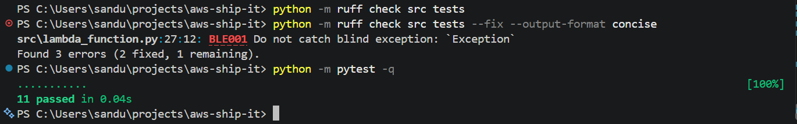
*Screenshot 6: ruff flagged BLE001, a rule that is not a ruff default. That exposed the hidden settings.*

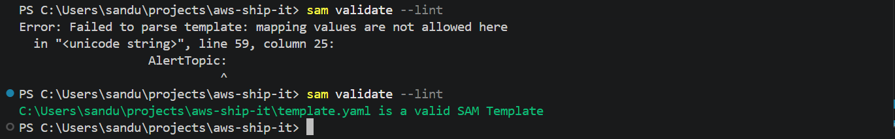
*Screenshot 7: `sam validate --lint` pointed to line 59. After the fix: "valid SAM Template".*

---

## 8. What it costs

**Short answer: close to nothing when idle.** Everything is pay-per-use, and nothing runs when nobody uses it.

Real numbers from my Billing console on 24 September 2026:

- My account is on the **AWS Free plan**. Credits pay the costs, and my card is not charged. **Estimated bill for September: USD 0.00.**
- Usage so far this month: **$2.15** (forecast $2.21). August was $0.08.
- That $2.15 came from EC2, Elastic Load Balancing, VPC and RDS. That is **Project 1**, which I rebuilt on 11 September for its chaos test. It is not this project.
- This project's services (Lambda, API Gateway, DynamoDB) are pay-per-request and don't appear among the top costs. Billing can lag by up to a day, so today's usage may not show yet.
- IAM and GitHub Actions on a public repo are free.
- Budget status: **OK**, 1 budget active.

**Security check:** the root user has MFA (multi-factor authentication) and no access keys. I used root only once, to turn on "IAM user and role access to Billing information", which only root can do. Then I went back to my everyday IAM login.

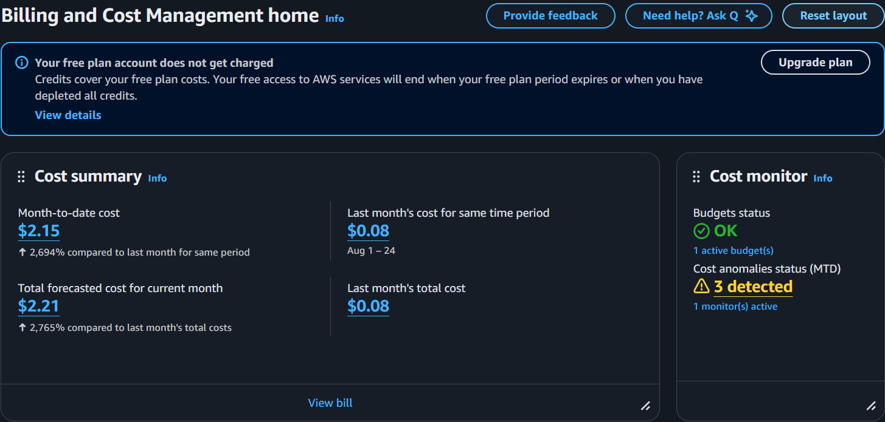
*Screenshot 26: month-to-date $2.15, budget OK.*

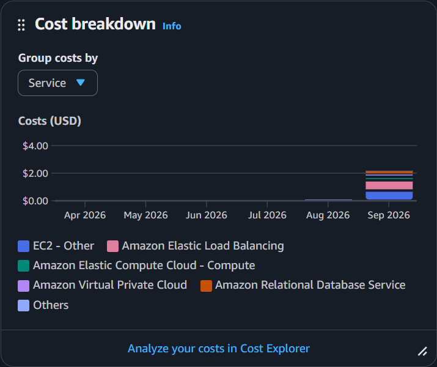
*Screenshot 27: September's costs came from Project 1's services (EC2, load balancer, VPC, RDS).*

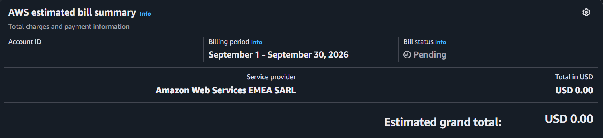
*Screenshot 28: estimated grand total USD 0.00 on the Free plan.*

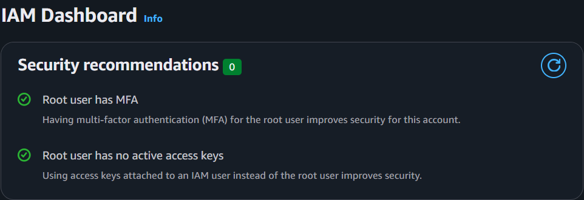
*Screenshot 25: 0 security recommendations. Root has MFA and no access keys.*

---

## 9. What I'd improve next

I cut these on purpose to finish a smaller project well. They were **not** built.

- **A production stage** behind a GitHub environment, with a person who must approve each release.
- **A Docker test-runner image**, plus `sam local` to test the API on my laptop.
- **An incident drill:** trigger the alarm on purpose, investigate with CloudWatch Logs Insights, and write an incident note.
- **A runbook:** step-by-step instructions for when something goes wrong.
- **A stronger handler:** return a clear "400 bad request" for broken input instead of crashing with a 500, and write logs as structured JSON.
- **Dependabot**, so GitHub tells me when my pipeline's actions need updating.
- **Pin or test the runner image.** GitHub's `ubuntu-latest` moves to Ubuntu 26 on 19 October 2026, and I want to know before it breaks anything.

---

## 10. What's in the repo

```
aws-ship-it/
├── .github/workflows/pipeline.yml   the pipeline: TEST job, then DEPLOY job
├── src/
│   ├── bill_rules.py                the pricing rules (from Project 2)
│   └── lambda_function.py           the thin wrapper AWS calls
├── tests/test_bill_rules.py         11 pytest tests
├── scripts/smoke_test.sh            calls the live API and checks the answer
├── template.yaml                    the whole backend as code (AWS SAM)
├── ruff.toml                        linter rules, so laptop = pipeline
├── pytest.ini
├── requirements-dev.txt             pytest, ruff, boto3
└── docs/images/                     the architecture diagram and screenshots
```

**Run the checks on your own laptop** (Python 3.14):

```bash
pip install -r requirements-dev.txt
ruff check src tests
pytest -q
sam validate --lint
```

---

*Bill Guard gives estimates to help people plan. It is not official AWS pricing.*
